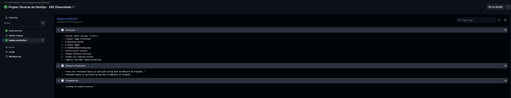
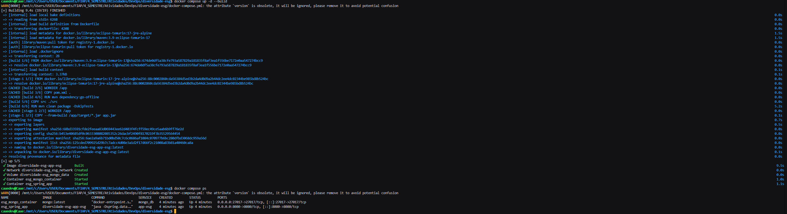
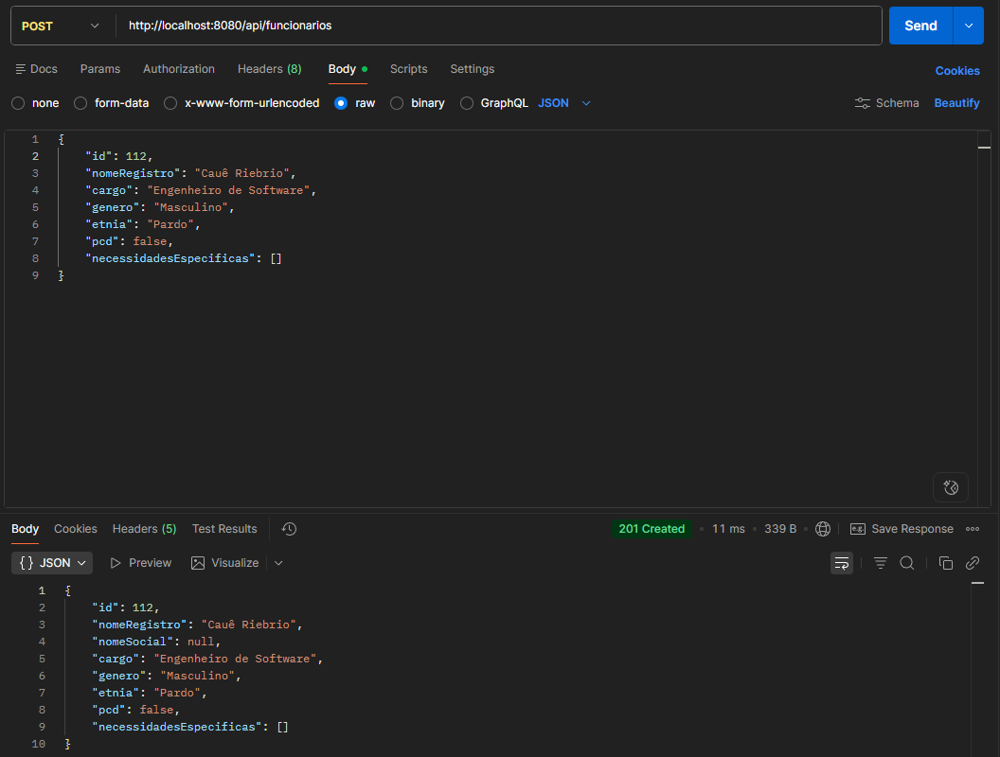
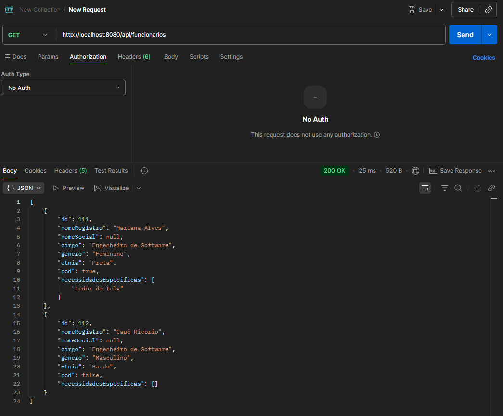

# Projeto - Cidades ESG Inteligentes

**Módulo:** Inclusão e Diversidade no Ambiente Corporativo

Este projeto é uma API RESTful desenvolvida para automatizar e monitorar metas de diversidade e inclusão nas empresas (Pilar Social e Governança do ESG). A aplicação utiliza uma arquitetura moderna baseada em contêineres e esteiras de integração contínua.

---

## 🚀 Como executar localmente com Docker

Para rodar a aplicação na sua máquina, você não precisa ter o Java ou o Maven instalados, apenas o ambiente Docker.

**Pré-requisitos:**

- [Docker Desktop](https://www.docker.com/products/docker-desktop/) ou Docker Engine instalado.
- Docker Compose.

**Passo a passo:**

1. Clone este repositório para a sua máquina local:

    ```bash
    git clone [URL_DO_SEU_REPOSITORIO]
    cd diversidade-esg
    ```

2. Execute o comando abaixo para construir as imagens e subir os contêineres em segundo plano:

```bash
docker compose up -d --build
```

3. Aguarde alguns segundos para o banco de dados e a aplicação iniciarem. Você pode acompanhar os logs com:

```bash
docker compose logs -f app-esg
```

4. A API estará disponível e pronta para receber requisições (GET/POST) no endereço:
   http://localhost:8080/api/funcionarios

## ⚙️ Pipeline CI/CD

Para garantir a qualidade e a governança do código entregue, implementamos um pipeline de Integração e Entrega Contínuas (CI/CD) utilizando o GitHub Actions.

Etapas do Pipeline:

Checkout & Setup: O pipeline baixa o código fonte e configura um ambiente com JDK 17 (Temurin).

Build & Test: Utilizando o Maven, o projeto é compilado e todos os testes unitários são executados. Se qualquer teste falhar, o pipeline é bloqueado (Gatekeeper), impedindo que bugs cheguem à produção.

Deploy em Staging: Disparado automaticamente quando há um Push ou Pull Request na branch develop. Serve para homologação.

Deploy em Produção: Disparado exclusivamente quando o código é mesclado na branch main.

Essa automação reduz o risco de falhas humanas e garante processos auditáveis, reforçando o pilar de Governança (G).

## 📦 Containerização

A orquestração local é feita via docker-compose.yml, que isola a rede da aplicação e do banco de dados (MongoDB), injetando as credenciais e URLs de conexão de forma segura via Variáveis de Ambiente.

Para a imagem da aplicação Spring Boot, adotamos a estratégia de Multi-stage Build para otimização de recursos (alinhado ao pilar Ambiental (E), pois imagens menores consomem menos armazenamento e banda nas nuvens).

#### Conteúdo do Dockerfile:

```dockerfile
Dockerfile
# Estágio 1: Build (Compilação do projeto do zero)
FROM maven:3.9-eclipse-temurin-17 AS build
WORKDIR /app

# Baixa as dependências em cache
COPY pom.xml .
RUN mvn dependency:go-offline

# Copia o código fonte e gera o artefato .jar
COPY src ./src
RUN mvn clean package -DskipTests

# Estágio 2: Execução (Imagem Final Otimizada e Leve)
FROM eclipse-temurin:17-jre-alpine
WORKDIR /app

# Copia APENAS o .jar gerado no passo anterior
COPY --from=build /app/target/*.jar app.jar

EXPOSE 8080

# Inicia a aplicação forçando a URL do banco na rede interna do Docker
ENTRYPOINT ["java", "-Dspring.data.mongodb.uri=mongodb://mongo_db:27017/esg_db"
```

## 📸 Prints do funcionamento

Nota: As imagens abaixo comprovam o funcionamento da esteira DevOps e da aplicação nos ambientes.

#### 1. Pipeline CI/CD executado com sucesso no GitHub Actions:

</img>

#### 2. Execução local via Docker (Containers Up):

</img>

#### 3. Teste de Inserção de Dados (Staging/Dev):

</img>

#### 4. Teste de Leitura de Dados (Produção):

</img>

## 🛠️ Tecnologias utilizadas

As seguintes ferramentas, frameworks e linguagens foram utilizadas na construção deste módulo:

Linguagem: Java 17

Framework Backend: Spring Boot 3 (Spring Web, Spring Data MongoDB)

Gerenciador de Dependências: Maven

Banco de Dados: MongoDB (NoSQL - Modelo Orientado a Documentos)

Containerização: Docker e Docker Compose (Multi-stage build, Alpine Linux)

CI/CD: GitHub Actions

Testes de API: Postman

## ✅ Checklist de Entrega

| Item                                                | OK  |
| :-------------------------------------------------- | :-: |
| Projeto compactado em .ZIP com estrutura organizada | [X] |
| Dockerfile funcional                                | [X] |
| docker-compose.yml ou arquivos Kubernetes           | [X] |
| Pipeline com etapas de build, teste e deploy        | [X] |
| README.md com instruções e prints                   | [X] |
| Documentação técnica com evidências (PDF ou PPT)    | [X] |
| Deploy realizado nos ambientes staging e produção   | [X] |
